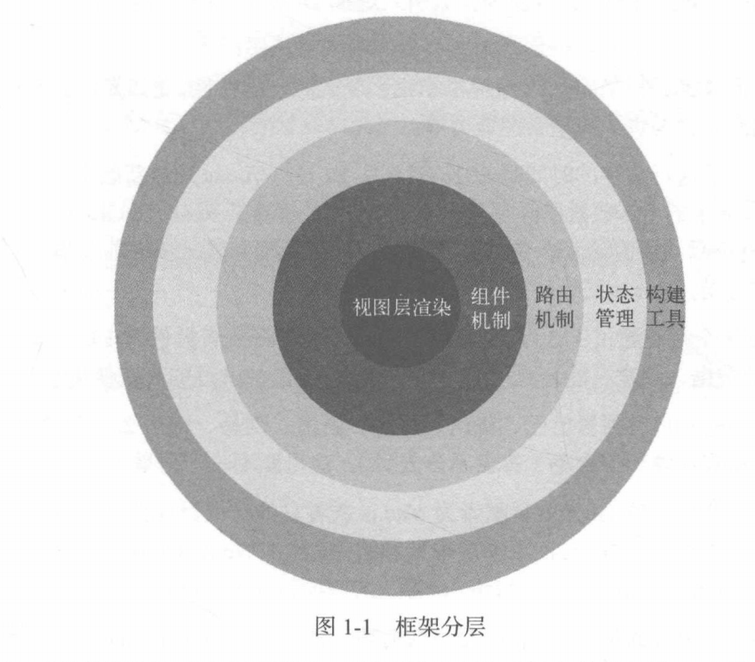
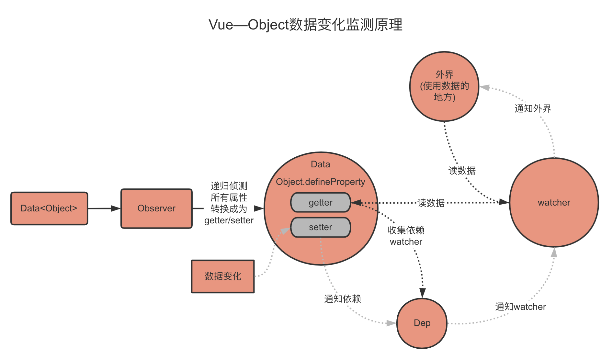
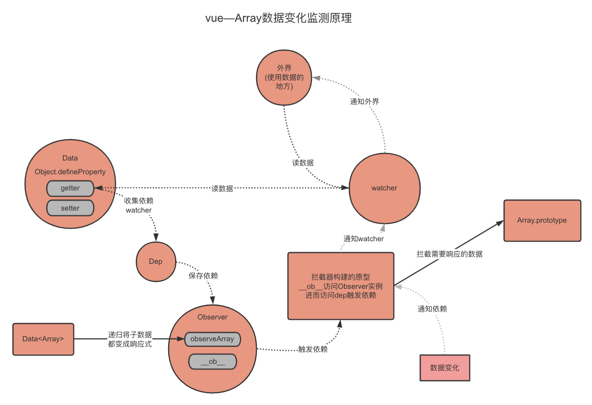
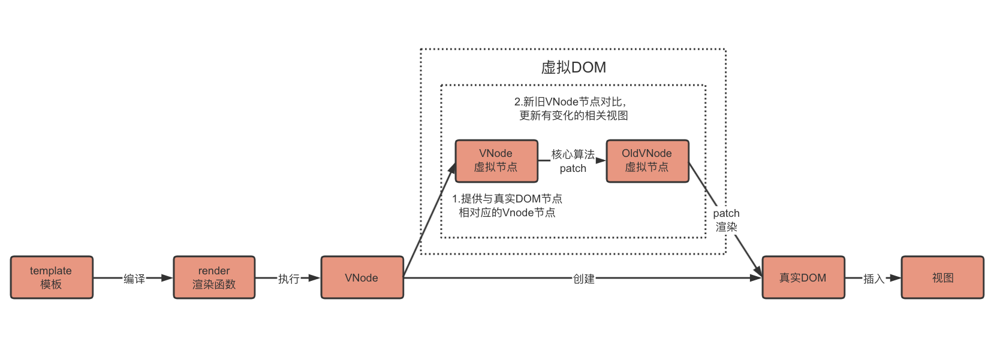

---


---

# 文章概述

## Vue是什么？

Vue本质上就是一个用 Function 实现的 Class，然后它的**原型 prototype** 以及**它本身**都**扩展了一系列的方法和属性**

**一个 Vue 应用会将其挂载到一个 DOM 元素上** ，**通过$mount将vm挂载到DOM元素上**。Vue 不能挂载在 `body`、`html` 这样的根节点上。

每个 Vue 应用都是通过用 `Vue` 函数创建一个新的 **Vue 实例**开始的。

一个 Vue 应用由一个通过 `new Vue` 创建的**根 Vue 实例**，以及可选的嵌套的、可复用的组件树组成。

Vue.js中通过**模板来描述状态与视图之间的映射关系**，所以它会**先将模板编译成渲染函数**， 然后**执行渲染函数生成虚拟节点**，最后使用**虚拟节点更新视图**。

Vue.js 2.0采取了一个**中等粒度的解决方案**，**状态侦测不再细化到某个具体节点，而是某个组件**，**组件内部通过虚拟DOM来渲染视图**，这可以大大缩减依赖数量和watcher数量。

## 渐进式框架



## 数据驱动

Vue.js 一个核心思想是数据驱动。所谓数据驱动，是指视图是由数据驱动生成的，我们对视图的修改，不会直接操作 DOM，而是通过修改数据。

#### **这一章的目标是弄清楚模板和数据如何渲染成最终的 DOM。**

### new Vue发生了什么

Vue 初始化主要就干了几件事情，合并配置，初始化生命周期，初始化事件中心，初始化渲染，初始化 data、props、computed、watcher 等等。

## vue响应式原理/变化监测

在vue中并不是所有的对象/数组都是响应式的。还有一些在代码里单纯的对象/数组。

Object.defineProperty监测数据变化—>通知组件—>组件内部通过dom渲染

收集依赖=》


### Object对象的变化监测

**读取数据触发getter=〉在getter中收集依赖watcher=〉收集在Dep中=》在setter中触发依赖**



Data通过Observer转换成了 getter/setter的形式来追踪变化。 当外界通过Watcher读取数据时，会触发getter从而将Watcher添加到依赖中。Object.defineProperty的getter中收集依赖到Dep。 当数据发生了变化时，会触发setter,从而向Dep中的依赖（Watcher ）发送通知。

Watcher接收到通知后，触发它们的 `update` 过程，这个过程又利用了队列做了进一步优化，在 `nextTick` 后执行所有 `watcher` 的 `run`，最后执行它们的回调函数。即向外界发送通知，变化通知到外界后可能会触发视图更新，也有 可能触发用户的某个回调函数等。

```
//eg:
<template>
	<hl>({ name }}</hl>
</template>
```

#### 依赖是什么？—watcher

所谓依赖说白了就是用到name的地方，因为用到name的地方依赖name的具体值。收集依赖就是收集用到了此数据的地方。

因为使用数据的地方很多，而且类型还不一样。即有可能是模板又有可能是用户写的watch。所以从这些情况中抽象出一个类，收集依赖的时候只要收集这些类的实例就行。这个抽象出来的类就是`watcher`。当数据变化的时候先去通知中间件watcher，它再去通知对应的地方。

#### watcher原理

Watcher的原理是先把自己设置到全局唯一的指定位置（例如window.target）,然后读取 数据。因为读取了数据，所以会触发这个数据的gettero接着，在getter中就会从全局唯一的那 个位置读取当前正在读取数据的Watcher,并把这个Watcher收集到Dep中去。通过这样的方式, Watcher可以主动去订阅任意一个数据的变化。

#### 递归侦测数据内所有属性—封装Observer类

Observer类会附加到每一个被侦测的object上。 这个类的作用是将一个数据内的所有属性(包括子属性)都转换成getter/setter的形式，然后去 追踪它们的变化。

#### 侦测Object类型数据变化导致的问题

因为Object数据的变化是通过`Object.defineProperty`的getter/setter来追踪的。可以追踪属性数据变化，但是无法追踪新增属性`this.obj.name='sss'`0r删除属性`delete this.obj.name`。

为了解决这个问题vue提供了API ;vm.$set()/vm.delete()

### Array变化监测

Array通过方法去改变内容，Array在getter中收集依赖，在拦截器中触发依赖。



#### 侦测Array类型数据变化导致的问题

因为侦测Array变化是通过拦截原型的方式实现的，所以有些变化vue监测不到。

- 修改数组的一个值

  ```
  this.list[0]=3;
  ```

- 改变数组length值

  ```
  this.length=0;
  ```

> 为了解决以上问题 **vue的解决方案**
>
> 1.Vue.set (object, propertyName, value) **/** vm.$set (object, propertyName, value)
>
> ⚠️ 这里Vue.set源码里对数组变成响应式的实现也用了`2`中的splice方法
>
> ```
> export function set (target: Array<any> | Object, key: any, val: any): any {
>   // target 为数组  
>   if (Array.isArray(target) && isValidArrayIndex(key)) {
>     // 修改数组的长度, 避免索引>数组长度导致splcie()执行有误
>     target.length = Math.max(target.length, key)
>     // 利用数组的splice变异方法触发响应式  
>     target.splice(key, 1, val)
>     return val
>   }
>   ...
>   ...
>   }	
> ```
>
> 2.vue的变异方法
>
> ```
> 'push',
>  'pop',
>  'shift',
>  'unshift',
>  'splice',
>  'sort',
>  'reverse'
> ```

## 虚拟dom

**—状态映射成视图的解决方案**

### 原理

Vue.js中通过**模板来描述状态与视图之间的映射关系**，所以它会**先将模板编译成渲染函数**， 然后**执行渲染函数生成虚拟节点**，最后使用**虚拟节点更新视图**。



### 为什么使用虚拟DOM?

1.直接用状态去生成真实dom，那么面临的就是状态改变就要重新生成dom，会造成一定程度的性能浪费

2.vue.js 1.0 通过细粒度绑定来更新视图。当状态变化时vue一定程度上知道哪个节点使用了这个状态，每个绑定都会有watcher来侦测状态。造成了较大的开销

3.所以Vue.js 2.0采取了一个**中等粒度的解决方案**，**状态侦测不再细化到某个具体节点，而是某个组件**，**组件内部通过虚拟DOM来渲染视图**，这可以大大缩减依赖数量和watcher数量。

## VNode 

在Vue.js中存在一个**VNode类**，使用它可以**实例化不同类型的vnode实例**，而不同类型的 vnode实例各自**表示不同类型的DOM元素**。DOM元素有元素节点、文本节点、注释节点等，vnode实例也会对应有这些节点。

当状态变化时通知到组件，按理来说整个组件都要渲染，但可以使用虚拟dom的方式，缓存上次的vnode结点与新的vnode做对比只对更新的部分进行dom操作，从而更新视图。

### 类型

- 注释节点

- 文本节点

- 元素节点

 **tag：**顾名思义，tag就是一个节点的名称，例如p、ul、li和div等。

 **data：**该属性包含了一些节点上的数据，比如attrs^ class和style等。

\***children：\***当前节点的子节点列表。

***\*context：\****它是当前组件的Vue.js实例。

- 组件节点

组件节点和元素节点类似，有以下两个独有的属性。

 ***\*componentoptions\*******\*:\****顾名思义，就是组件节点的选项参数，其中包含propsData. tag 和children等信息。

 ***\*componentinstance：\****组件的实例，也是Vue.js的实例。事实上，在Vue.js中，每个组件 都是一个Vue.js实例。

一个组件节点：

```
<child></child>
```

所对应的vnode是下面的样子：

```
{

  componentinstance: {・・・},

  componentoptions: {・・.},

  context: {...},

  data: {...}

  tag: "vue-component-1-child",	

}
```

- 函数式组件

- 克隆节点

## Vue  🆚  JQuery

Vue.js 一个核心思想是数据驱动。所谓数据驱动，是指视图是由数据驱动生成的，我们对视图的修改，不会直接操作 DOM，而是通过修改数据。它相比我们传统的前端开发，如使用 jQuery 等前端库直接修改 DOM，大大简化了代码量，程序的状态也更好管理。

并且**操纵DOM速度比较慢。**

## vue生命周期

vue每个组件都是独立的，每个组件都有一个属于它的生命周期，从一个组件**创建、数据初始化、挂载、更新、销毁**，这就是一个组件所谓的生命周期。


```
props` ->`methods` ->`data` -> `computed` -> `watch
```

## vue-router

2-后

https://juejin.im/post/6844903945530245133