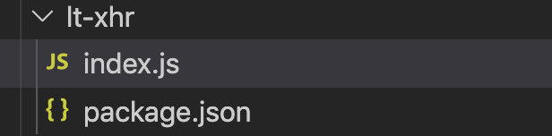

# xii的实习日记Day023

## HTTP—fly.js

[fly.js帮助文档](https://wendux.github.io/dist/#/doc/flyio/readme)

### 简介

Fly.js 是一个基于 promise 的，轻量且强大的Javascript http 网络库，它有如下特点：

1. 提供统一的 Promise API。
2. 浏览器环境下，**轻量且非常轻量** 。
3. 支持多种JavaScript 运行环境
4. 支持请求／响应拦截器。
5. 自动转换 JSON 数据。
6. **支持切换底层 Http Engine，可轻松适配各种运行环境**。
7. **浏览器端支持全局Ajax拦截 。**
8. **H5页面内嵌到原生 APP 中时，支持将 http 请求转发到 Native。支持直接请求图片**。

### 常见写法

get请求

```javascript
var fly=require("flyio")
//通过用户id获取信息,参数直接写在url中
fly.get('/user?id=133')
  .then(function (response) {
    console.log(response);
  })
  .catch(function (error) {
    console.log(error);
  });

//query参数通过对象传递
fly.get('/user', {
      id: 133
  })
  .then(function (response) {
    console.log(response);
  })
  .catch(function (error) {
    console.log(error);
  });
```

post请求

```javascript
fly.post('/user', {
    name: 'Doris',
    age: 24
    phone:"18513222525"
  })
  .then(function (response) {
    console.log(response);
  })
  .catch(function (error) {
    console.log(error);
  });
```

直接通过request发起请求

```javascript
//直接调用request函数发起post请求
fly.request("/test",{hh:5},{
    method:"post",
    timeout:5000 //超时设置为5s
 })
.then(d=>{ console.log("request result:",d)})
.catch((e) => console.log("error", e))
```

### 项目中常见写法

首先项目中利用fly.js分装成了一个单独的http请求模块。供多个项目共享。这样会使service层更加清晰，并且请求更简便。



在模块中统一处理请求相关的内容。`export default (type, url, param = {}, isUnderline2Hump = true, extraParams) => {}`

```
import xhr from 'lt-xhr';

export const getCreatePanorama = param => xhr('get', '/resource/vr/custom_vr/index', param);

```

