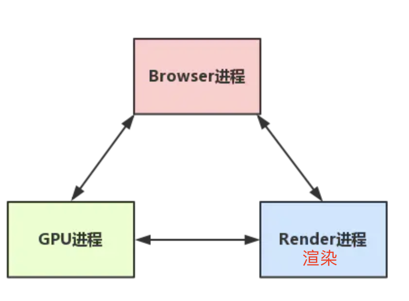
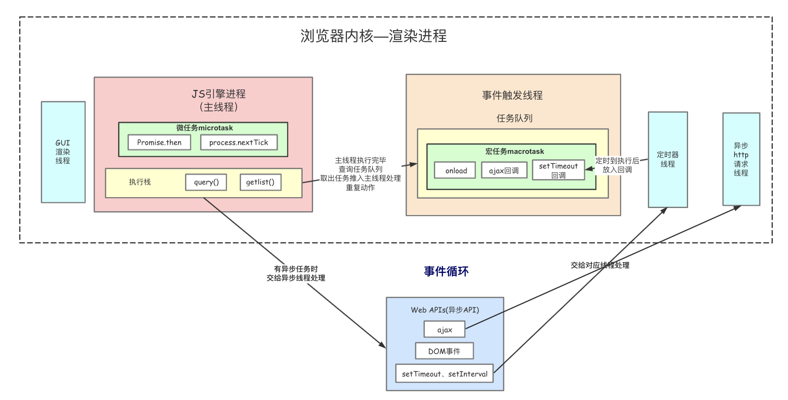
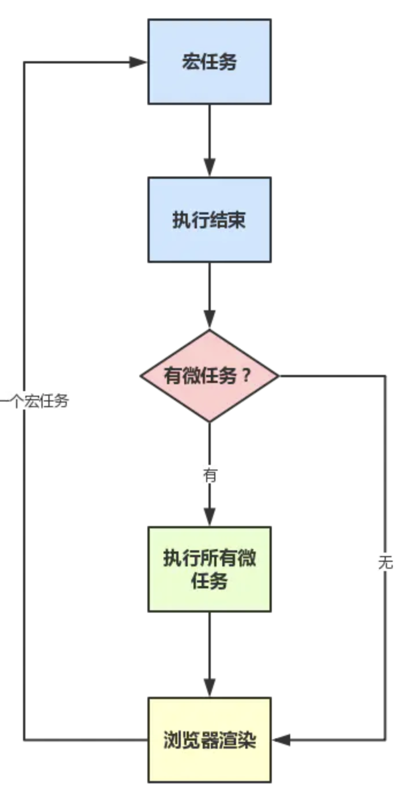

# xii的实习日记day031

## 浏览器

### 浏览器是多线程的

**在浏览器中打开一个网页相当于新起了一个进程（进程内有自己的多线程）**

#### 多线程的优势

- 避免单个page crash影响整个浏览器
- 避免第三方插件crash影响整个浏览器
- 多进程充分利用多核优势

#### 浏览器渲染进程

**1.GUI渲染线程**

- 负责渲染浏览器界面，解析HTML，CSS，构建DOM树和RenderObject树，布局和绘制等。
- 当界面需要重绘（Repaint）或由于某种操作引发回流(reflow)时，该线程就会执行
- 注意，**GUI渲染线程与JS引擎线程是互斥的**，当JS引擎执行时GUI线程会被挂起（相当于被冻结了），GUI更新会被保存在一个队列中**等到JS引擎空闲时**立即被执行。

**2.JS引擎线程**

- 也称为JS内核，负责处理Javascript脚本程序。（例如V8引擎）
- JS引擎线程负责解析Javascript脚本，运行代码。
- JS引擎一直等待着任务队列中任务的到来，然后加以处理，**一个Tab页**（renderer进程）中无论什么时候都**只有一个JS线程**在运行JS程序
- 同样注意，**GUI渲染线程与JS引擎线程是互斥的**，所以如果JS执行的时间过长，这样就会造成页面的渲染不连贯，导致页面渲染加载阻塞。

**3.事件触发线程**

- 归属于浏览器而不是JS引擎，用来**控制事件循环**（可以理解，JS引擎自己都忙不过来，需要浏览器另开线程协助）
- 当JS引擎执行代码块如setTimeOut时（也可来自浏览器内核的其他线程,如鼠标点击、AJAX异步请求等），会将对应任务添加到事件线程中
- 当对应的事件符合触发条件被触发时，该线程会把事件添加到待处理队列的队尾，等待JS引擎的处理
- 注意，由于JS的单线程关系，所以这些待处理队列中的事件都得排队等待JS引擎处理（当JS引擎空闲时才会去执行）

**4.定时触发器线程**

- 传说中的`setInterval`与`setTimeout`所在线程
- 浏览器定时计数器并不是由JavaScript引擎计数的,（因为JavaScript引擎是单线程的, 如果处于阻塞线程状态就会影响记计时的准确）
- 因此通过单独线程来计时并触发定时（计时完毕后，添加到事件队列中，等待JS引擎空闲后执行）
- 注意，W3C在HTML标准中规定，规定要求setTimeout中低于4ms的时间间隔算为4ms。

**5.异步http请求线程**

- 在XMLHttpRequest在连接后是通过浏览器新开一个线程请求
- 将检测到状态变更时，如果设置有回调函数，异步线程就**产生状态变更事件**，将这个回调再放入事件队列中。再由JavaScript引擎执行。

#### Browser主控进程和Renderer进程浏览器内核的通信过程

如果自己打开任务管理器，然后打开一个浏览器，就可以看到：**任务管理器中出现了两个进程（一个是主控进程，一个则是打开Tab页的渲染进程）**， 然后在这前提下，看下整个的过程：(简化了很多)

- Browser进程收到用户请求，首先需要获取页面内容（譬如通过网络下载资源），随后将该任务通过RendererHost接口传递给Render进程
- Renderer进程的Renderer接口收到消息，简单解释后，交给渲染线程，然后开始渲染
  - 渲染线程接收请求，加载网页并渲染网页，这其中可能需要Browser进程获取资源和需要GPU进程来帮助渲染
  - 当然可能会有JS线程操作DOM（这样可能会造成回流并重绘）
  - 最后Render进程将结果传递给Browser进程



### 浏览器渲染流程

```
- 浏览器输入url，浏览器主进程接管，开一个下载线程，
然后进行 http请求（略去DNS查询，IP寻址等等操作），然后等待响应，获取内容，
随后将内容通过RendererHost接口转交给Renderer进程

- 浏览器渲染流程开始
复制代码
```

浏览器器内核拿到内容后，渲染大概可以划分成以下几个步骤：

1. 解析html建立dom树
2. 解析css构建render树（将CSS代码解析成树形的数据结构，然后结合DOM合并成render树）
3. 布局render树（Layout/reflow），负责各元素尺寸、位置的计算
4. 绘制render树（paint），绘制页面像素信息
5. 浏览器会将各层的信息发送给GPU，GPU会将各层合成（composite），显示在屏幕上。

所有详细步骤都已经略去，渲染完毕后就是`load`事件了，之后就是自己的JS逻辑处理了

既然略去了一些详细的步骤，那么就提一些可能需要注意的细节把

### 事件循环

到此时，已经是属于浏览器页面初次渲染完毕后的事情，JS引擎的一些运行机制分析。

JS分为同步任务和异步任务

同步任务都在主线程上执行，形成一个`执行栈`

主线程之外，**事件触发线程**管理着一个`任务队列`，只要异步任务有了运行结果，就在`任务队列`之中放置一个事件。

一旦`执行栈`中的所有同步任务执行完毕（此时JS引擎空闲），系统就会读取`任务队列`，将可运行的异步任务添加到可执行栈中，开始执行。

#### 微任务+宏任务

进一步，JS中分为两种任务类型：**`macrotask`和`microtask`**，在ECMAScript中，microtask称为`jobs`，macrotask可称为`task`

它们的定义？区别？简单点可以按如下理解：

- macrotask（又称之为宏任务），可以理解是每次执行栈执行的代码就是一个宏任务（包括每次从事件队列中获取一个事件回调并放到执行栈中执行）
  - 每一个task会从头到尾将这个任务执行完毕，不会执行其它
  - 浏览器为了能够使得JS内部task与DOM任务能够有序的执行，会在一个task执行结束后，在下一个 task 执行开始前，对页面进行重新渲染 （`task->渲染->task->...`）
- microtask（又称为微任务），可以理解是在当前 task 执行结束后立即执行的任务
  - 也就是说，在当前task任务后，下一个task之前，在渲染之前
  - 所以它的响应速度相比setTimeout（setTimeout是task）会更快，因为无需等渲染
  - 也就是说，在某一个macrotask执行完后，就会将在它执行期间产生的所有microtask都执行完毕（在渲染前）

分别很么样的场景会形成macrotask和microtask呢？

- macrotask：主代码块，setTimeout，setInterval等（可以看到，事件队列中的每一个事件都是一个macrotask）
- microtask：Promise，process.nextTick等

**补充：在node环境下，process.nextTick的优先级高于Promise**，也就是可以简单理解为：在宏任务结束后会先执行微任务队列中的nextTickQueue部分，然后才会执行微任务中的Promise部分。

再根据线程来理解下：

- macrotask中的事件都是放在一个事件队列中的，而这个队列由**事件触发线程**维护
- microtask中的所有微任务都是添加到**微任务队列**（Job Queues）中，等待当前macrotask执行完毕后执行，而这个队列由**JS引擎线程维护** （这点由自己理解+推测得出，因为它是在主线程下无缝执行的）

所以，总结下运行机制：

- 执行一个宏任务（栈中没有就从事件队列中获取）
- 执行过程中如果遇到微任务，就将它添加到微任务的任务队列中
- 宏任务执行完毕后，立即执行当前微任务队列中的所有微任务（依次执行）
- 当前宏任务执行完毕，开始检查渲染，然后GUI线程接管渲染
- 渲染完毕后，JS线程继续接管，开始下一个宏任务（从事件队列中获取）

流程图如下：






#### 测试题目

```
console.log(1)
setTimeout(()=>{console.log(2)},1000)
async function fn(){
    console.log(3)
    setTimeout(()=>{console.log(4)},20)
    return Promise.reject()
}
async function run(){
    console.log(5)
    await fn()
    console.log(6)
}
run()
//需要执行150ms左右
for(let i=0;i<90000000;i++){} //执行完之后下一个setTimeout立即加入事件队列中了
setTimeout(()=>{
    console.log(7)
    new Promise(resolve=>{
        console.log(8)
        resolve()
    }).then(()=>{console.log(9)})
},0)
console.log(10)
// 1 5 3 10 4 7 8 9 2

```

